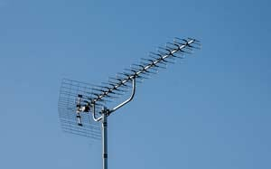
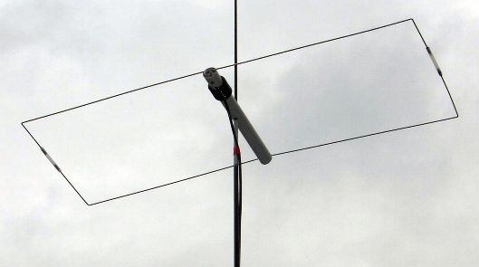

# Bitacora de Cursado - Ricco Germán

**18/03/2026**:

Armado de un inductor bobinando un alambre esmaltado en una lapicera.

**25/03/2026**:

Armado de un capacitor utilizando los fondos de dos latas de aluminio.

**01/04/2026**:

**08/04/2026**: 

**10/04/2026**: 

En base a las fotos sacadas de la luna, obtuvimos de los metadatos el valor de apertura, exposición y el valor f, para a posterior hacer un análisis y poder replicar esas mismas condiciones en otras cámaras y así estandarizar nuestras capturas de la ISS.

**15/04/2026**: 

Utilizamos una antena larga hecha con cable sostenida por el mastil de la bandera para escuchar frecuencias lejanas usando las condiciones de la ionosfera del atardecer. Pudimos escuchar radiofrecuencias de otros paises.

**22/04/2026**:

Nos pusimos a simular distintos tipos de antenas en la computadora para compararlas entre sí. El profesor entregó un listado de configuraciones tipo "magnetic loop" que debíamos simular: 

* Dipolo
* Paragua (quad loop)
* Moxon
* Cintra de metro (presumiblemente un loop cuadrado o rectangular)
* Yagi
* Random Wire
* End‑Ded Half Wave (EFHW)
* End‑Fed Random Wire (EFRW). 

El objetivo fue comparar las ganancias directivas de cada topología; aquella con mayor ganancia y relación frente/back será la que desarrollemos como proyecto real. 

En la práctica, ajustamos parámetros geométricos de la Moxon (espaciado entre elementos, longitudes del driver y reflector), ejecutamos el cálculo de patrones de radiación y analizamos los diagramas de far field y la ROE simulada. La **Moxon** mostró un compromiso interesante entre tamaño reducido y ganancia moderada, superior al dipolo de referencia.

**29/04/2026**:

Revisamos el modelo físico real de la **antena Moxon**. Decidimos quedarnos con este diseño para el prototipo final ya que, aunque la **Yagi** nos daba un poco más de ganancia teórica en las simulaciones (aproximadamente 1.5 dB de diferencia en el lóbulo principal), priorizamos compacidad y robustez para integrarla mejor al soporte motorizado.

**Antena Yogi**

La Antena Moxon presenta una **relación frente/back superior** en un **volumen reducido**, lo que facilita el montaje sobre el mástil rotatorio sin generar un momento de torsión excesivo. También calculamos las medidas exactas para que funcione en la frecuencia que necesitamos para el prototipo sintonizado a 145 MHz (banda de 2 metros, dentro del segmento de aficionados) y vamos a verificarlas con el medidor antes de ponernos a construirla.

**Antena Moxon**

**06/05/2026**:

Se suspendieron las clases por viendo zonda

**13/05/2026**:

**20/05/2026**:

Ayude a cortar un caño longitudinal